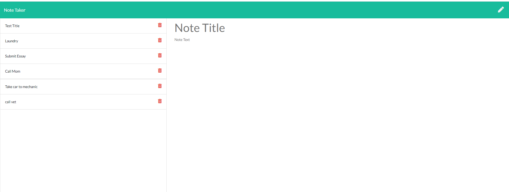

# Note Taker App 

## Description 
USER STORY: 

AS A small business owner

I WANT to be able to write and save notes

SO THAT I can organize my thoughts and keep track of tasks I need to complete

You don't even have to be a small business owner! Stay at home mom, college student, or even an astronaut! The Note Taker App is exactly as its name describes it! You can use this to take notes and save them for later. Refresh the page, and still find them there! Deployed on Heroku, you can add new notes and delete them whenever you want!

Here is what the app looks like: 

Here is the link to the application! Check it out!

[Click here to check it out!](https://murmuring-basin-76991.herokuapp.com/)

## Questions
 Github Username : melissabarrerafarias
  
  [Link to Github Profile](https://github.com/melissabarrerafarias)

  If you have any further questions or curiosities, feel free to contact me through email at melissabarrerafarias@gmail.com!
